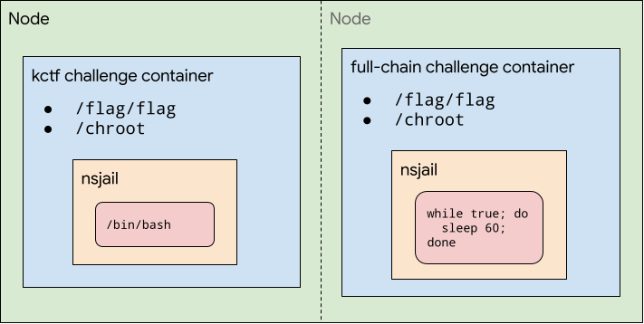

# kCTF VRP Setup

We invite you to demonstrate an exploit against our kCTF demo cluster based on the challenges presented on this page. Successful demonstrations which don't use Linux kernel vulnerabilities are eligible for rewards as described in our [kCTF VRP announcement blog post](https://security.googleblog.com/2020/05/expanding-our-work-with-open-source.html).

**Important note:** If you'd like to demonstrate an exploit against a Linux kernel vulnerability, please submit it to [our kernelCTF program](https://google.github.io/security-research/kernelctf/rules.html). **kCTF VRP does not accept Linux kernel vulnerabilities anymore** since 2023-06-14. For more information read our blog post "[Learnings from kCTF VRP's 42 Linux kernel exploits submissions](https://security.googleblog.com/2023/06/learnings-from-kctf-vrps-42-linux.html)".

[kCTF](https://github.com/google/kctf) is an open source infrastructure for CTF competitions. You can find details on how it works in the [kCTF documentation](https://google.github.io/kctf/introduction.html), but in short, it’s running on a hardened Kubernetes cluster with the following security features:

*   The OS and Kubernetes versions are upgraded automatically.
*   The nodes are running Container-Optimized OS.
*   Pod egress network access is restricted to public IPs only.
*   [Workload Identity](https://cloud.google.com/blog/products/containers-kubernetes/introducing-workload-identity-better-authentication-for-your-gke-applications) restricts access to service accounts and the metadata server in addition to the network policies.
*   Every connection to a challenge spawns a separate [nsjail](https://github.com/google/nsjail) sandbox to isolate players from each other.

At present, we’re interested in two attack scenarios against this infrastructure:

1. Breaking out of the nsjail sandbox as it would allow solving challenges in unintended ways.
2. Breaking the isolation that Kubernetes provides and accessing the flags of other challenges.

For this purpose, we set up two kCTF challenges with secret flags: “kctf” and “full-chain”. You can demonstrate a working exploit by leaking the flags of either of these.
You can find the code for the challenges
[here](https://github.com/google/google-ctf/tree/master/vrp).




## kctf challenge

The “kctf” challenge is the only entry point to the cluster. You can connect to it via:

**Older cluster (GKE Regular release channel):**
```
socat FILE:`tty`,raw,echo=0 TCP:kctf.vrp.ctfcompetition.com:1337
```

**Newer cluster (GKE Rapid release channel):**
```
socat FILE:`tty`,raw,echo=0 TCP:kctf.vrp2.ctfcompetition.com:1337
```

It will ask you to solve a proof-of-work and then gives you access to a bash running in a setup similar to the [kCTF pwn template challenge](https://github.com/google/kctf/tree/beta/dist/challenge-templates/pwn). The only difference is that the flag is not accessible inside of the nsjail sandbox and you will need to break out of the chroot in order to read it. You can observe the full source code [here](https://github.com/google/google-ctf/tree/master/vrp).

The details of the environment of the VM can be read from `/etc/node-os-release`, and you can get the image of the VM following [this script](https://gist.github.com/sirdarckcat/568934df2b33a125b0b0f42a5366df8c) based on the output of `/etc/node-os-release`.


## full-chain challenge

The “full-chain” challenge is a challenge that runs a `while sleep` loop and doesn’t have any exposed ports. In order to get access to the flag, you will need to break out of the “kctf” challenge and break the pod isolation of the cluster.


## Flags

The flags are stored in Kubernetes [secrets](https://kubernetes.io/docs/concepts/configuration/secret/) and mounted to the filesystem of the two challenges at “/flag/flag”. They are of the format:


```
KCTF{$CHAL_NAME-$TIMESTAMP:$MAC}
```


As you can see, the flags include a timestamp and are rotated frequently.

### Submission

We want to avoid learning about unfixed vulnerabilities, so the process to submit reports is:
  1. Test your exploit - we recommend you to test it locally first, and run a GKE cluster to debug.
  2. If it is a 0day (there's no patch for it yet), then send us a checksum of your working exploit to our form [here](https://docs.google.com/forms/d/e/1FAIpQLSeQf6aWmIIjtG4sbEKfgOBK0KL3zzeHCrsgA1EcPr-xsFAk7w/viewform). You won't share any technical details about the vulnerability, you will just record the fact you found something (as we only reward the first person that writes an exploit for a given bug, we use it to resolve the timing in case of an exploit collision). Make sure to submit the exploit checksum **before** there's a public patch and to submit the full exploit **within a week** after the patch is public. If you take longer than a week, we might issue the reward to someone else.
  3. For 1days or once there is a public patch, test your exploit it on the [lab environment](#kctf-challenge). If you have troubles let us know in [#kctf](https://discord.gg/V8UqnZ6JBG) and we'll help you figure out any problems.
  4. Once you get the flag, send it together with the patch and the exploit [here](https://docs.google.com/forms/d/e/1FAIpQLSeQf6aWmIIjtG4sbEKfgOBK0KL3zzeHCrsgA1EcPr-xsFAk7w/viewform).
  5. To increase the timely sharing of new techniques with the community, we are also now requiring that the exploits that receive innovation bonus get publicly documented within a month, otherwise we may publish it.

### Notes

We want to encourage the community to help research vulnerabilities, but which are still unfixed since they have not been shown to be exploitable. As such:

*   The person that develops the exploit and receives the reward might not be the same as the person that discovered or patched the vulnerability.
*   It's ok to use 1-day exploits against the lab environment using publicly known vulnerabilities that exploit the patch gap between the time when a patch is announced and the lab environment is updated, however we will only issue a single reward per vulnerability.

**When we receive an exploit for a fixed vulnerability we'll add details [here](https://docs.google.com/spreadsheets/d/e/2PACX-1vS1REdTA29OJftst8xN5B5x8iIUcxuK6bXdzF8G1UXCmRtoNsoQ9MbebdRdFnj6qZ0Yd7LwQfvYC2oF/pubhtml).**

In case of questions or suggestions, you can reach us in [#kctf](https://discord.gg/V8UqnZ6JBG).
